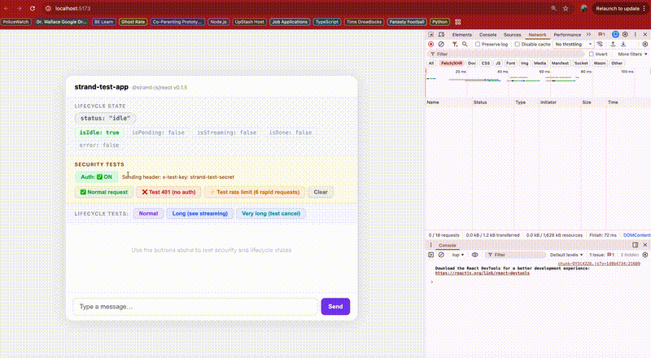

# strand

**AI state management for React.** The layer between your UI and your LLM.

TypeScript-first. Provider-agnostic. Works with React 18+ and Node 18+.



---

## The problem

Every time you add AI to a React app, you write the same 200 lines:

```ts
// You write this. Every time. In every project.
const [messages, setMessages] = useState([])
const [isLoading, setIsLoading] = useState(false)

async function send(text) {
  setIsLoading(true)
  const updated = [...messages, { role: 'user', content: text }]
  setMessages(updated)

  const res = await fetch('/api/chat', { method: 'POST', body: JSON.stringify({ messages: updated }) })
  const reader = res.body.getReader()

  // manually stream tokens into state
  // manually detect tool_use blocks in the stream
  // manually append tool_result messages and loop
  // manually handle errors, rate limits, timeouts
  // manually reset isLoading — if you remembered
}
```

Strand eliminates this. It is to LLM interactions what RTK Query is to REST APIs.

---

## Install

**Client (browser):**
```bash
npm install @strand-js/core @strand-js/react zod
```

**Server:**
```bash
# Anthropic (Claude)
npm install @strand-js/anthropic

# OpenAI (GPT)
npm install @strand-js/openai

# Google (Gemini)
npm install @strand-js/google
```

**React Native:**
```bash
npm install @strand-js/react-native
```

---

## How it works

Strand splits cleanly across your stack:

```
Browser                    Your Server               LLM Provider
─────────────────────      ──────────────────────    ─────────────
@strand-js/react              @strand-js/anthropic         Anthropic API
useConversation()    ───►  createStrandHandler() ───► claude-*
useToolCall()              (tool execution here)
useAgentSession()    ◄───  SSE stream ◄───────────── streaming tokens
```

Your API key never leaves your server. Your React hooks never touch raw HTTP.

---

## Quick start

### 1. Set up the server endpoint

```ts
// server.ts — Express / Fastify / Hono / any Node.js framework
import { createStrandHandler } from '@strand-js/anthropic'

app.post('/api/strand', createStrandHandler({
  apiKey: process.env.ANTHROPIC_API_KEY,
  model: 'claude-sonnet-4-6',
}))
```

Next.js App Router:
```ts
// app/api/strand/route.ts
import { createStrandRoute } from '@strand-js/anthropic'

export const POST = createStrandRoute({
  apiKey: process.env.ANTHROPIC_API_KEY,
  model: 'claude-sonnet-4-6',
})
```

### 2. Configure the client

```tsx
// main.tsx
import { createStrandClient } from '@strand-js/core'
import { StrandProvider } from '@strand-js/react'

const client = createStrandClient({ baseUrl: '/api/strand' })

function App() {
  return (
    <StrandProvider client={client}>
      <YourApp />
    </StrandProvider>
  )
}
```

### 3. Use the hooks

```tsx
import { useConversation } from '@strand-js/react'

function Chat() {
  const { messages, send, isPending, isStreaming, isDone, cancel } = useConversation({
    system: 'You are a helpful assistant.',
  })

  return (
    <div>
      {messages.map(m => (
        <div key={m.id} data-role={m.role}>
          {m.content}
        </div>
      ))}

      {isPending && <div>Waiting...</div>}
      {isStreaming && <div>Typing...</div>}

      <input
        disabled={isPending || isStreaming}
        onKeyDown={e => {
          if (e.key === 'Enter') send(e.currentTarget.value)
        }}
      />

      {(isPending || isStreaming) && (
        <button onClick={cancel}>Stop</button>
      )}
    </div>
  )
}
```

---

## Core concepts

### Streaming lifecycle

Strand tracks four distinct states. Other libraries collapse these into a single `isLoading` boolean — which is why they get stuck.

```
idle  →  submitting  →  streaming  →  done  →  idle
                                  ↘  error →  idle
```

| State | Meaning | Boolean shorthand |
|---|---|---|
| `idle` | No active request | `isIdle: true` |
| `submitting` | Request sent, no tokens yet | `isPending: true` |
| `streaming` | Tokens arriving | `isStreaming: true` |
| `done` | Response complete, resetting | `isDone: true` |
| `error` | Request failed | `error: Error` |

After `done` or `error`, status returns to `idle` on the next tick. `isDone` gives you a window to react to completion before the reset.

### The Message type

```ts
interface Message {
  id: string
  role: 'user' | 'assistant'
  content: string             // accumulated text (updates during streaming)
  toolCalls?: ToolCall[]      // present when the model invoked tools
  createdAt: Date
}

interface ToolCall {
  id: string
  name: string
  input: Record<string, unknown>    // resolved when streaming completes
  output: unknown | null            // null until tool execution finishes
  status: 'pending' | 'running' | 'done' | 'failed'
  error: Error | null
}
```

### Sessions

A session is more than a messages array. It carries identity, token budget, and a lifecycle.

```ts
interface Session {
  id: string
  messages: Message[]
  status: 'idle' | 'submitting' | 'streaming' | 'done' | 'error'
  tokenUsage: { input: number; output: number; total: number }
  error: Error | null
}
```

Sessions are isolated by default. Pass a `sessionId` to `useConversation` to share state across components or persist it across mounts.

### Tool call state

Every tool call has an observable lifecycle — not just a flat array at the end.

```
pending  →  running  →  done
                     ↘  failed
```

Use `useToolCall` to subscribe to a specific tool's state anywhere in your tree.

---

## API reference

### `createStrandClient(config)`

Creates the client instance. Pass it to `<StrandProvider>` or directly to any hook.

```ts
const client = createStrandClient({
  baseUrl: '/api/strand',        // required — your backend endpoint
  retry: {
    maxAttempts: 3,              // default: 3
    backoff: 'exponential',      // 'exponential' | 'linear' | 'none'
    retryOn: ['rate_limit', 'server_error'],
  },
  contextWindow: {
    strategy: 'truncate-oldest', // 'truncate-oldest' | 'sliding-window' | 'none'
    maxTokens: 100_000,
  },
})
```

---

### `<StrandProvider client={client}>`

Provides the client to all hooks in the tree. All hooks read the client from context — omit the `client` prop on individual hooks when using the provider.

```tsx
<StrandProvider client={client}>
  <App />
</StrandProvider>
```

---

### `useConversation(options)`

The main hook. Manages a full conversation with streaming, tool calls, and history.

```ts
const {
  messages,       // Message[]
  send,           // (content: string, options?: SendOptions) => void
  status,         // 'idle' | 'submitting' | 'streaming' | 'done' | 'error'
  isPending,      // request in-flight, no tokens yet
  isStreaming,    // tokens arriving
  isIdle,         // no active request
  isDone,         // response just completed (resets to idle next tick)
  error,          // Error | null
  cancel,         // () => void
  clear,          // () => void — reset conversation history
  tokenUsage,     // { input: number, output: number, total: number }
} = useConversation({
  system,         // string — system prompt
  tools,          // ToolDefinition[] — Zod-typed tool schemas
  onToolResult,   // (name, args, output) => void — observer fired after tool completes
  context,        // Record<string, unknown> — stable per-request context
  sessionId,      // string — share or persist state by ID
  onFinish,       // (message: Message) => void
  onError,        // (error: Error) => void
  client,         // StrandClient — omit if using StrandProvider
})
```

**Defining tools** with Zod for type-safe inputs:

```ts
import { z } from 'zod'
import { tool } from '@strand-js/core'

const weatherTool = tool({
  name: 'get_weather',
  description: 'Get current weather for a location',
  parameters: z.object({
    location: z.string().describe('City name or coordinates'),
    unit: z.enum(['celsius', 'fahrenheit']).default('fahrenheit'),
  }),
})

const { messages, send } = useConversation({
  tools: [weatherTool],
  onToolCall: async (name, args) => {
    if (name === 'get_weather') return fetchWeather(args.location, args.unit)
  },
})
```

**Stable context** — attach dynamic values to every request. Unlike `useChat`, these never go stale:

```ts
const { send } = useConversation({
  context: {
    userId: user.id,      // updates correctly as user changes
    locale: settings.locale,
  },
})
```

**Client tools vs server tools** — tools can be executed on either side:
- Define in `onToolCall` on the hook: executes in the browser. Good for UI interactions, reading local state, navigation.
- Define in `onToolCall` on the server handler: executes on your server. Good for database access, external APIs, secrets.
- If the same tool name is defined on both sides, the **server takes precedence**.

---

### `useToolCall(toolName, options?)`

Subscribe to the real-time state of a specific tool call. Scoped to the nearest `StrandProvider` in the tree. If you have multiple providers (e.g., two independent chat panels), each `useToolCall` subscribes to its own provider's session.

```ts
const {
  status,     // 'idle' | 'pending' | 'running' | 'done' | 'failed'
  input,      // T | null — resolved when streaming input completes
  output,     // R | null — result when done
  error,      // Error | null
  isRunning,  // boolean
} = useToolCall<WeatherInput, WeatherResult>('get_weather')
```

Show live tool progress anywhere in your tree:

```tsx
function WeatherToolStatus() {
  const { status, input, output } = useToolCall('get_weather')

  if (status === 'running') return <Spinner label={`Checking weather in ${input?.location}...`} />
  if (status === 'done') return <WeatherCard data={output} />
  return null
}
```

---

### `useAgentSession(options)`

Multi-step agentic flows with observable step-by-step state. The agent runs a loop — calling tools and generating responses — until it reaches a final answer or `maxSteps`.

```ts
const {
  status,       // 'idle' | 'running' | 'paused' | 'done' | 'failed'
  steps,        // AgentStep[]
  currentStep,  // AgentStep | null
  stepCount,    // number
  run,          // (goal: string) => void
  pause,        // () => void
  resume,       // () => void
  cancel,       // () => void
  result,       // string | null — final answer when done
  error,        // Error | null
} = useAgentSession({
  system,       // string — agent persona and instructions
  maxSteps: 10,
  tools: [...],
  onToolCall: async (name, args) => myTools[name](args),
  onStep: (step) => { },
  onComplete: (result) => { },
  client,       // omit if using StrandProvider
})
```

```tsx
function ResearchAgent() {
  const { status, steps, currentStep, run, cancel, result } = useAgentSession({
    system: 'You are a research assistant. Use tools to find accurate answers.',
    maxSteps: 15,
    tools: [searchTool, summarizeTool],
    onToolCall: async (name, args) => myTools[name](args),
  })

  return (
    <div>
      <button onClick={() => run('What are the latest developments in quantum computing?')}>
        Research
      </button>

      {status === 'running' && (
        <div>
          Step {steps.length}: {currentStep?.description}
          <button onClick={cancel}>Stop</button>
        </div>
      )}

      {status === 'done' && <p>{result}</p>}
    </div>
  )
}
```

---

### `useStreamingText(stream)`

Low-level primitive for building custom hooks or rendering a raw stream outside of a full conversation. If you're using `useConversation`, you don't need this — the text is already in `messages`.

```ts
const {
  text,        // string — accumulated text so far
  delta,       // string — most recent token chunk
  isDone,      // boolean
  isStreaming, // boolean
} = useStreamingText(readableStream)  // ReadableStream<string>
```

---

## Server-side setup

### `createStrandHandler(config)` options

Full configuration for the Express/Fastify/Hono handler:

```ts
app.post('/api/strand', createStrandHandler({
  apiKey: string,
  model: string,
  system?: string | ((request: Request) => string | Promise<string>),
  tools?: ToolDefinition[],
  onToolCall?: async (name, args, ctx: { request: Request }) => unknown,
  maxSteps?: number,           // default: 10
  onRequest?: (req: Request) => void,
  onFinish?: (session: Session) => void,
}))
```

Dynamic system prompts — read auth headers, tenant config, user preferences:

```ts
createStrandHandler({
  apiKey: process.env.ANTHROPIC_API_KEY,
  model: 'claude-sonnet-4-6',
  system: async (request) => {
    const user = await getUserFromRequest(request)
    return `You are a helpful assistant for ${user.companyName}.`
  },
})
```

---

## React Native

React Native's `fetch` doesn't support streaming. `@strand-js/react-native` patches the transport layer transparently — no API changes, no config required.

```bash
npm install @strand-js/react-native
```

```ts
// App.tsx — must be the first import
import '@strand-js/react-native'
```

All hooks work identically after this. Works with Expo SDK 50+ and bare React Native 0.73+.

---

## OpenAI

```bash
npm install @strand-js/openai
```

```ts
import { createStrandHandler } from '@strand-js/openai'

app.post('/api/strand', createStrandHandler({
  apiKey: process.env.OPENAI_API_KEY,
  model: 'gpt-4o',
}))
```

The client and all React hooks are provider-agnostic — zero changes on the frontend when switching providers.

---

## Google (Gemini)

```bash
npm install @strand-js/google
```

```ts
import { createStrandHandler } from '@strand-js/google'

app.post('/api/strand', createStrandHandler({
  apiKey: process.env.GOOGLE_API_KEY,
  model: 'gemini-2.0-flash',
}))
```

Get a free API key at [aistudio.google.com](https://aistudio.google.com).

---

## Why Strand?

| | Strand | Vercel AI SDK | Raw SDK |
|---|---|---|---|
| Providers | Anthropic, OpenAI, Google | Anthropic, OpenAI, Google | One at a time |
| React Native | ✅ Day one | ❌ Broken by default | ❌ DIY |
| Per-tool state (`useToolCall`) | ✅ | ❌ | ❌ |
| Streaming lifecycle (4 states) | ✅ | ⚠️ Known `isLoading` bugs | ❌ |
| Context window management | ✅ Built in | ❌ Explicitly excluded | ❌ |
| Stable context injection | ✅ | ❌ Stale closure footgun | ❌ |
| Retry / backoff | ✅ Built in | ❌ Third party only | ❌ |
| Built-in auth + rate limiting | ✅ | ❌ | ❌ |
| Framework agnostic | ✅ | ⚠️ NextJS-centric | ✅ |
| Parallel tool call state | ✅ | ⚠️ Open bug | ❌ |
| Stable versioning contract | ✅ | ❌ 4 majors in 2 years | — |

Strand is not a Vercel AI SDK replacement for every use case. If you're deep in the Next.js App Router ecosystem and the SDK's primitives are enough, stick with what you have. Strand is for teams who've outgrown them — or who are starting fresh and don't want to rebuild the same boilerplate again.

---

## Requirements

- React 18+
- Node.js 18+ (server)
- TypeScript 5+ (recommended — types are the primary interface)

---

## Roadmap

### v1 (current)
- `@strand-js/core`, `@strand-js/react`, `@strand-js/anthropic`, `@strand-js/openai`, `@strand-js/google`, `@strand-js/react-native`
- `useConversation`, `useToolCall`, `useAgentSession`, `useStreamingText`
- Built-in auth, rate limiting, input validation
- Retry/backoff, context window management, parallel tool call state

### v2
- Conversation branching (fork from any message, navigate history as a tree)
- Durable sessions (survive disconnects, reconnect from checkpoint)
- Parallel sub-agent orchestration

---

## Contributing

Strand is early. If you hit a use case the API doesn't serve, [open an issue](https://github.com/strand-js/strand/issues). Real-world feedback shapes v1 more than anything else.

---

## License

MIT
